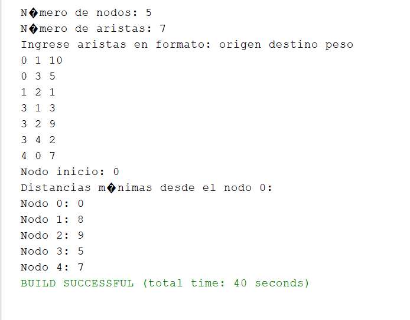

# 🌐 Teoría de Grafos – UTPL

## 🚀 Método de Prim para Árboles de Expansión Mínima

El **algoritmo de Prim** es una técnica para construir un árbol que conecte todos los nodos de un grafo sin ciclos y con el costo total más bajo posible. Se aplica en grafos no dirigidos y con pesos positivos en sus conexiones.

### 🔎 Principales puntos:

- Se usa en grafos **no dirigidos** con valores asignados a sus aristas.
- Emplea estructuras de datos como montículos o listas para seleccionar la arista con menor peso.
- Los valores de las aristas deben ser **positivos o cero**.

### Pseudocódigo del Algoritmo:

```pseudo
Prim(G, nodo_inicio):
    Para cada vértice v en G:
        distancia[v] ← ∞
        padre[v] ← nulo
        visitado[v] ← falso

    distancia[nodo_inicio] ← 0

    Mientras existan vértices no visitados:
        u ← vértice no visitado con menor distancia[u]
        visitado[u] ← verdadero

        Para cada vecino v de u:
            si peso(u, v) < distancia[v] y v no visitado:
                distancia[v] ← peso(u, v)
                padre[v] ← u
```

# 🔄 Grafos con Direccionalidad

Un **grafo dirigido** consiste en aristas que tienen un sentido definido, es decir, se va de un nodo origen hacia un nodo destino.

Cada arista se denota como **(origen, destino)**.

La dirección indica un flujo o camino que solo puede recorrerse en un sentido.

---

## 📊 Formas de representación comunes

- **Listas de vecinos**  
  Donde cada nodo tiene un conjunto de nodos a los que apunta.

- **Matriz de pesos**  
  Una tabla donde la posición `[i][j]` indica el peso de la arista desde _i_ hacia _j_, o un valor muy alto si no hay conexión.

---

## 💡 Consideración

Los pesos asignados son fundamentales para calcular rutas eficientes.

---

# 🏆 Algoritmo para Ruta Más Corta: Dijkstra

Este algoritmo encuentra la distancia mínima desde un punto de partida a todos los demás vértices en un grafo, considerando que las aristas no tengan pesos negativos.

---

## ⚙️ ¿Cómo funciona?

1. Inicializa la distancia a todos los nodos en infinito, salvo el nodo inicial que queda en cero.
2. Usa una estructura que permita extraer el nodo más cercano aún no procesado.
3. Actualiza (relaja) las distancias a los vecinos de ese nodo.
4. Continúa hasta que todos los nodos hayan sido visitados.

---

## 📜 Pseudocódigo

```pseudo
Dijkstra(G, nodo_origen):
    Para cada nodo n en G:
        distancia[n] ← infinito
        previo[n] ← null
        visitado[n] ← falso

    distancia[nodo_origen] ← 0

    Mientras existan nodos no visitados:
        u ← nodo no visitado con menor distancia[u]
        visitado[u] ← verdadero

        Para cada vecino v de u:
            si no visitado[v] y distancia[u] + peso(u, v) < distancia[v]:
                distancia[v] ← distancia[u] + peso(u, v)
                previo[v] ← u
```



## ✔️ Requisitos

- Puede aplicarse en grafos dirigidos o no dirigidos.
- Los pesos deben ser cero o positivos.

## ⏳ Complejidad

Implementado con montículo binario, tiene un tiempo aproximado de **O((V + E) log V)**.
