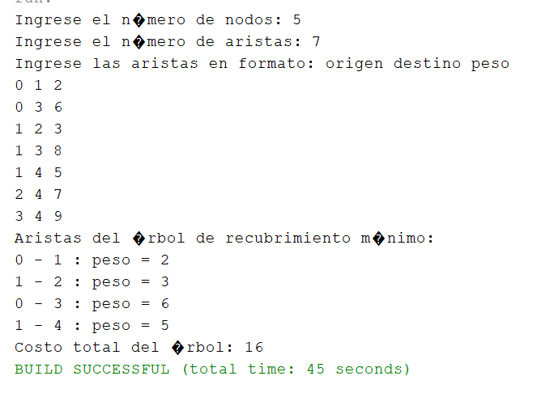

# 🎲 Algoritmos de Monte Carlo y Árbol de Expansión Mínima con Prim

## 🌟 Introducción a los Algoritmos de Monte Carlo

Los algoritmos de Monte Carlo son métodos que utilizan procesos aleatorios para obtener soluciones aproximadas a problemas complejos.  
A diferencia de los algoritmos deterministas, estos aprovechan la generación de números aleatorios para realizar simulaciones o estimaciones probabilísticas.

### Características principales:

- Utilizan azar para explorar el espacio de soluciones.
- No garantizan una respuesta exacta, pero sí una buena aproximación.
- Son útiles cuando los métodos clásicos son demasiado lentos o complejos.
- La precisión mejora aumentando el número de simulaciones.

---

## 🔍 Ejemplo clásico: Estimación del valor de π

1. Se genera una gran cantidad de puntos aleatorios dentro de un cuadrado.
2. Se cuenta cuántos puntos caen dentro de un círculo inscrito en ese cuadrado.
3. La proporción de puntos dentro del círculo respecto al total permite aproximar π mediante una fórmula basada en áreas.

Este método ilustra cómo la probabilidad y el azar pueden usarse para resolver problemas numéricos.

---

## ⚠️ Consideraciones importantes

- La calidad del generador de números aleatorios influye en los resultados.
- Los resultados pueden variar en cada ejecución.
- Requiere validar el nivel de confianza estadística.

---

## 🏗️ Tarea: Implementación del Algoritmo de Prim

**Consigna:**  
Desarrolle una aplicación que permita encontrar el árbol de recubrimiento mínimo a partir de un grafo no dirigido usando el algoritmo de **Prim**.

### Requisitos:

- El grafo debe ser ponderado y conexo.
- El programa debe solicitar:
  - Número de nodos.
  - Aristas con sus pesos.
- Mostrar paso a paso las aristas que se agregan al árbol.
- Al final, mostrar el costo total del árbol de recubrimiento mínimo.

---

## 💻 Pseudocódigo básico de Prim

```java
import java.util.*;

public class PrimMST {

    static class Arista {
        int destino;
        int peso;

        public Arista(int destino, int peso) {
            this.destino = destino;
            this.peso = peso;
        }
    }

    public static void prim(int vertices, List<List<Arista>> grafo) {
        boolean[] visitado = new boolean[vertices];
        int[] padres = new int[vertices];
        int[] pesos = new int[vertices];

        Arrays.fill(pesos, Integer.MAX_VALUE);
        padres[0] = -1; // Nodo inicial
        pesos[0] = 0;

        for (int i = 0; i < vertices - 1; i++) {
            int u = minPeso(pesos, visitado, vertices);
            visitado[u] = true;

            for (Arista arista : grafo.get(u)) {
                int v = arista.destino;
                int peso = arista.peso;
                if (!visitado[v] && peso < pesos[v]) {
                    padres[v] = u;
                    pesos[v] = peso;
                }
            }
        }

        // Mostrar resultado
        int costoTotal = 0;
        System.out.println("Aristas del árbol de recubrimiento mínimo:");
        for (int i = 1; i < vertices; i++) {
            System.out.println(padres[i] + " - " + i + " : peso = " + pesos[i]);
            costoTotal += pesos[i];
        }
        System.out.println("Costo total del árbol: " + costoTotal);
    }

    private static int minPeso(int[] pesos, boolean[] visitado, int vertices) {
        int min = Integer.MAX_VALUE;
        int minIndex = -1;

        for (int v = 0; v < vertices; v++) {
            if (!visitado[v] && pesos[v] < min) {
                min = pesos[v];
                minIndex = v;
            }
        }
        return minIndex;
    }

    public static void main(String[] args) {
        Scanner sc = new Scanner(System.in);

        System.out.print("Ingrese el número de nodos: ");
        int vertices = sc.nextInt();

        List<List<Arista>> grafo = new ArrayList<>();
        for (int i = 0; i < vertices; i++) {
            grafo.add(new ArrayList<>());
        }

        System.out.print("Ingrese el número de aristas: ");
        int aristas = sc.nextInt();

        System.out.println("Ingrese las aristas en formato: origen destino peso");
        for (int i = 0; i < aristas; i++) {
            int u = sc.nextInt();
            int v = sc.nextInt();
            int peso = sc.nextInt();

            if (u < 0 || u >= vertices || v < 0 || v >= vertices) {
                System.out.println("Error: nodos fuera de rango. Intente de nuevo.");
                i--;
                continue;
            }

            // Grafo no dirigido: agregar ambas direcciones
            grafo.get(u).add(new Arista(v, peso));
            grafo.get(v).add(new Arista(u, peso));
        }

        prim(vertices, grafo);
        sc.close();
    }
}

```


