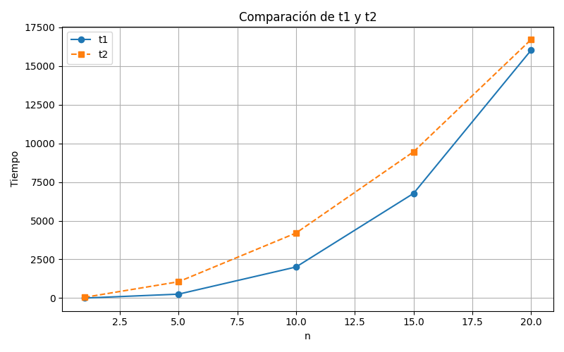

## Semana 4

### Notación Asintótica

- Saber cómo crece el tiempo de ejecución, cuando el tamaño de la entrada crece. Esto es la eficiencia asintótica del algoritmo.
- Se describe por medio de una función cuyo dominio es los números naturales (N).
- Depende de:
  - La velocidad de la computadora
  - El lenguaje de programación y el compilador
    Otros factores
- Ejemplo:
  Supón que un algoritmo, que corre con una entrada de tamaño n, se tarda:
  $ t(n) = 6n^2 + 100n+300$
$t(1) = 406$
  $t(10) = 1900$

- Diríamos que el tiempo de ejecución de este algoritmo crece como $n^2$, descartando el coeficiente.
- Al descartar los términos menos significativos y los coeficientes constantes, podemos enfocarnos en la parte importante de la ejecución.

#### Notación "para el orden de"

- Métrica para determinar la eficiencia de los algoritmos.
- Se dice que $O(f(n))$ define un "orden de complejidad"
- La mejor técnica para diferenciar la eficiencia de los algoritmos es el estudio de los **órdenes de complejidad**.

  | P1  | $T1(n)$ -> $O(f(n))$ |
  | --- | -------------------- |
  | P2  | $T2(n)$ -> $O(g(n))$ |

- Si $T1(n)=2n^3+n+1$
- Si $T2(n)=42n^2+7$

    |n|t1 |t2|$o(t1(n))$|$o(t2(n))$
    |---|---|---|---|---
    |1 |4   | 49|2 |42
    |5|256|1057|250|1050
    |10|2011|4207|2000|4200
    |15|6766|9457|6750|9450
    |20|16021|16707|16000|16800

