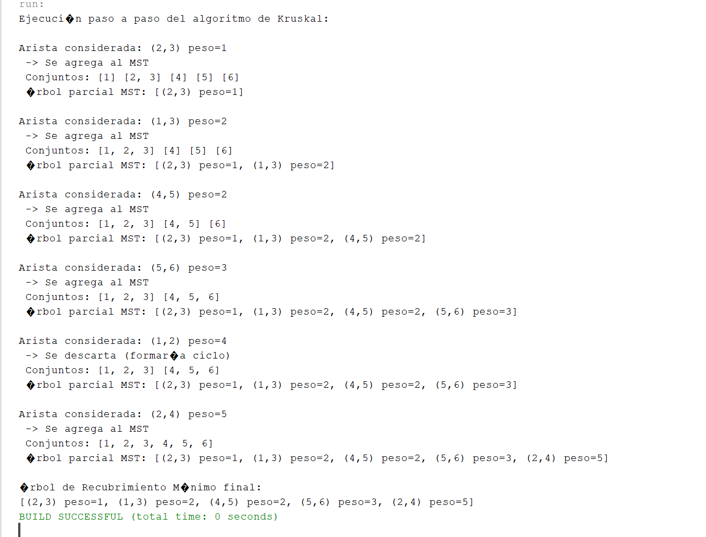

# Algoritmo de Kruskal

El **algoritmo de Kruskal** se utiliza para encontrar el **Árbol de Recubrimiento Mínimo (MST)** de un grafo no dirigido y ponderado.

## 🧠 ¿Cómo funciona?

1. Ordena todas las aristas del grafo en orden creciente según su peso.
2. Inicializa un conjunto disjunto (Union-Find) para detectar ciclos.
3. Itera sobre las aristas ordenadas:
   - Si la arista conecta dos componentes diferentes, se **agrega al MST**.
   - Si la arista forma un ciclo, se **descarta**.
4. Se detiene cuando el MST contiene `n - 1` aristas.

---

## ✅ Ejemplo en Java

El siguiente código implementa el algoritmo de Kruskal y muestra paso a paso cómo se construye el MST:

```java
package algoritmokruskal;

import java.util.*;

public class Kruskal {

    static class Arista implements Comparable<Arista> {
        int nodoA, nodoB, peso;

        Arista(int nodoA, int nodoB, int peso) {
            this.nodoA = nodoA;
            this.nodoB = nodoB;
            this.peso = peso;
        }

        @Override
        public int compareTo(Arista otra) {
            return Integer.compare(this.peso, otra.peso);
        }

        @Override
        public String toString() {
            return "(" + (nodoA + 1) + "," + (nodoB + 1) + ") peso=" + peso;
        }
    }

    static class DisjointSet {
        int[] padre;

        DisjointSet(int n) {
            padre = new int[n];
            for (int i = 0; i < n; i++) {
                padre[i] = i;
            }
        }

        int encontrar(int x) {
            if (padre[x] != x) {
                padre[x] = encontrar(padre[x]);
            }
            return padre[x];
        }

        void unir(int x, int y) {
            int raizX = encontrar(x);
            int raizY = encontrar(y);
            if (raizX != raizY) {
                padre[raizY] = raizX;
            }
        }

        Map<Integer, List<Integer>> conjuntosActuales() {
            Map<Integer, List<Integer>> conjuntos = new TreeMap<>();
            for (int i = 0; i < padre.length; i++) {
                int raiz = encontrar(i);
                conjuntos.putIfAbsent(raiz, new ArrayList<>());
                conjuntos.get(raiz).add(i + 1);
            }
            return conjuntos;
        }
    }

    public static void main(String[] args) {
        int numeroNodos = 6;

        List<Arista> listaAristas = Arrays.asList(
            new Arista(0, 1, 4),   // (1,2)
            new Arista(0, 2, 2),   // (1,3)
            new Arista(1, 2, 1),   // (2,3)
            new Arista(1, 3, 5),   // (2,4)
            new Arista(2, 3, 8),   // (3,4)
            new Arista(2, 4, 10),  // (3,5)
            new Arista(3, 4, 2),   // (4,5)
            new Arista(3, 5, 6),   // (4,6)
            new Arista(4, 5, 3)    // (5,6)
        );

        Collections.sort(listaAristas);

        DisjointSet conjuntoDisjunto = new DisjointSet(numeroNodos);
        List<Arista> mst = new ArrayList<>();

        System.out.println("Ejecución paso a paso del algoritmo de Kruskal:\n");

        for (Arista arista : listaAristas) {
            int raizA = conjuntoDisjunto.encontrar(arista.nodoA);
            int raizB = conjuntoDisjunto.encontrar(arista.nodoB);

            System.out.println("Arista considerada: " + arista);

            if (raizA != raizB) {
                System.out.println(" -> Se agrega al MST");
                mst.add(arista);
                conjuntoDisjunto.unir(raizA, raizB);
            } else {
                System.out.println(" -> Se descarta (formaría ciclo)");
            }

            System.out.print(" Conjuntos: ");
            conjuntoDisjunto.conjuntosActuales().values().forEach(grupo -> System.out.print(grupo + " "));
            System.out.println("\n Árbol parcial MST: " + mst + "\n");

            if (mst.size() == numeroNodos - 1) break;
        }

        System.out.println("Árbol de Recubrimiento Mínimo final:");
        System.out.println(mst);
    }
}
```

# Resultados


